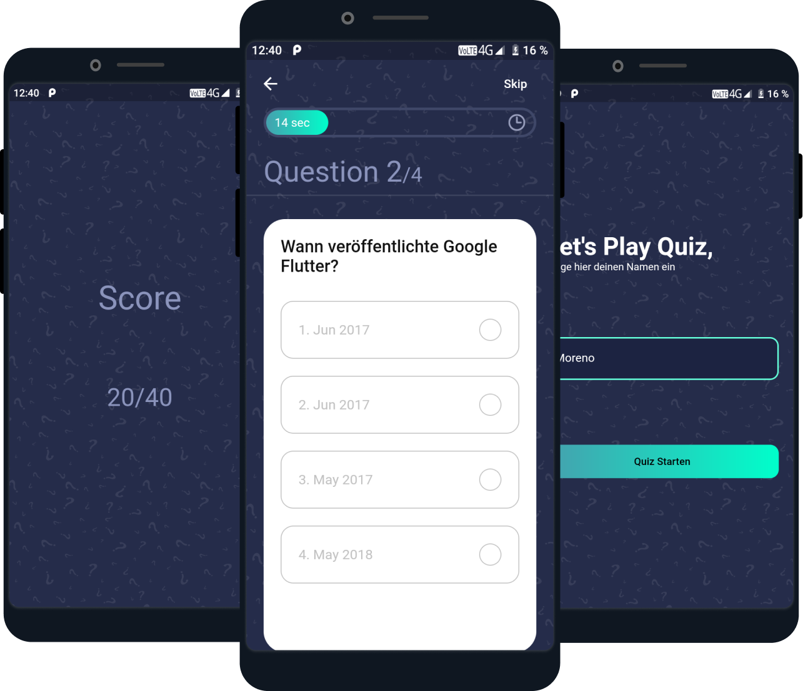

## Overview
- Eine Flutter Quiz App.

## Features
- Begrüßungsbildschirm, auf dem ein Benutzer seinen Namen eingibt
- Hauptbildschirm, der eine Frage mit 4 Antwortmöglichkeiten hat
- Wenn die Antwort korrekt ist, wird sie grün, andernfalls rot
- Zeitlimit pro Frage
- Am Ende des Bewertungsbildschirms können Sie Ihre Punktzahl überprüfen

## Setup & Installation
- Einfach das Projekt von GitHub kopieren und mit Get from Version Control öffnen

## ChangeLog & Roadmap
- Fertiggestellt am 5.03.2021
- In Zukunft wird die Anpassung an verschiedene Display Größen verbessert, ein Reetry Button zum Bewertungsbildschirms und mehr Fragen hinzugefügt.

## Credits
- Inspiration: https://www.youtube.com/c/TheFlutterWay/videos

